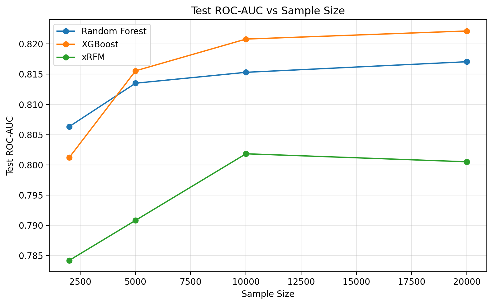
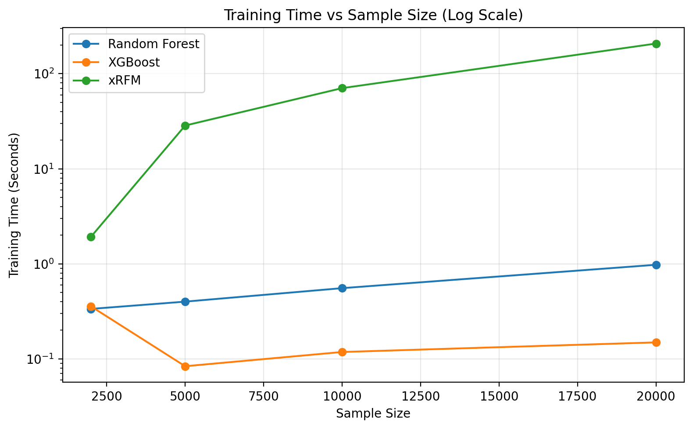

# COMP9417 Group Project: Sleep Binary Classification

## Project Overview

This repository contains one implemented line of a COMP9417 group project.  
The current work focuses on a binary classification task on a sleep-related tabular dataset, where the target variable is `felt_rested`.

The repository currently covers:

- data inspection and preprocessing for mixed-type tabular data
- single-model training pipelines
- controlled scaling experiments across multiple training set sizes
- result export and plotting for report-ready comparison

## Dataset

- Dataset path: `data/raw/sleep_health_dataset.csv`
- Task type: binary classification
- Target column: `felt_rested`
- Dataset characteristics:
  - more than 10,000 samples
  - mixed numeric and categorical features
  - suitable for train/validation/test evaluation and scaling analysis

The following columns are removed before model training:

- `person_id`
- `sleep_disorder_risk`
- `cognitive_performance_score`

## Models

The repository currently implements three models:

- XGBoost
- xRFM
- Random Forest

## Project Structure

```text
data/
  raw/
    sleep_health_dataset.csv
  processed/
  splits/

src/
  config.py
  data_loading.py
  preprocessing.py
  splitting.py
  metrics.py
  timing.py
  train_xgboost.py
  train_xrfm.py
  train_random_forest.py

scripts/
  check_environment.py
  check_xrfm_api.py
  inspect_data.py
  run_xgboost.py
  run_xrfm.py
  run_random_forest.py
  run_scaling_experiment.py
  plot_scaling_results.py
  tune_xrfm.py
  tune_xrfm_round2.py

results/
  metrics/
  figures/
  predictions/
```

## Reproducibility

The current pipelines follow these conventions:

- model selection is done on the validation split
- final reported numbers are taken from the held-out test split
- random seeds are fixed for reproducibility
- preprocessing is fit on the training data before being applied to validation and test data

The scaling experiment uses a stricter protocol:

- one fixed full train/validation/test split is created on the full dataset
- only the fixed training split is subsampled for different training sizes
- validation and test splits stay unchanged across all sample sizes and all models

## Main Scripts

- `scripts/check_environment.py`
  - checks whether the required Python packages can be imported
- `scripts/run_xgboost.py`
  - runs the XGBoost training pipeline on the sleep dataset
- `scripts/run_xrfm.py`
  - runs the xRFM training pipeline on the sleep dataset
- `scripts/run_random_forest.py`
  - runs the Random Forest training pipeline on the sleep dataset
- `scripts/run_scaling_experiment.py`
  - runs the unified three-model scaling comparison under the fixed-split protocol
- `scripts/plot_scaling_results.py`
  - reads the saved scaling results and generates report-ready figures and a concise summary table
- `scripts/tune_xrfm.py`
  - first-round lightweight xRFM tuning on a fixed sample size
- `scripts/tune_xrfm_round2.py`
  - second-round xRFM tuning centered on the strongest first-round configuration

## Key Outputs

The main output files for reporting are:

- `results/metrics/scaling_experiment_results.csv`
- `results/metrics/scaling_experiment_summary.csv`
- `results/figures/test_roc_auc_vs_sample_size.png`
- `results/figures/training_time_vs_sample_size_log.png`

Additional per-model metrics and tuning outputs are also stored under `results/metrics/`.

## Results

The figures below are generated from the strict scaling protocol:

- one fixed full `train/validation/test` split on the full dataset
- subsampling applied only to the fixed training split
- unchanged validation and test sets across all sample sizes and all models

### Test ROC-AUC vs Sample Size



### Training Time vs Sample Size (Log Scale)



### Concise Scaling Summary

| Model | Sample Size | Test Accuracy | Test ROC-AUC | Training Time (s) | Inference / Sample (s) |
|---|---:|---:|---:|---:|---:|
| Random Forest | 2000 | 0.7297 | 0.8063 | 0.3357 | 3.0642e-06 |
| Random Forest | 5000 | 0.7329 | 0.8135 | 0.4003 | 4.1631e-06 |
| Random Forest | 10000 | 0.7356 | 0.8153 | 0.5549 | 3.5794e-06 |
| Random Forest | 20000 | 0.7369 | 0.8171 | 0.9774 | 4.3288e-06 |
| XGBoost | 2000 | 0.7208 | 0.8012 | 0.3568 | 3.1021e-07 |
| XGBoost | 5000 | 0.7330 | 0.8156 | 0.0837 | 3.1116e-07 |
| XGBoost | 10000 | 0.7364 | 0.8208 | 0.1182 | 3.3307e-07 |
| XGBoost | 20000 | 0.7402 | 0.8222 | 0.1491 | 3.4257e-07 |
| xRFM | 2000 | 0.7170 | 0.7842 | 1.9284 | 5.3652e-06 |
| xRFM | 5000 | 0.7225 | 0.7908 | 28.5112 | 3.0092e-05 |
| xRFM | 10000 | 0.7263 | 0.8018 | 70.5745 | 8.5321e-05 |
| xRFM | 20000 | 0.7242 | 0.8005 | 207.7274 | 1.3497e-04 |

## Notes

This repository currently covers the sleep binary classification line of the group project.
